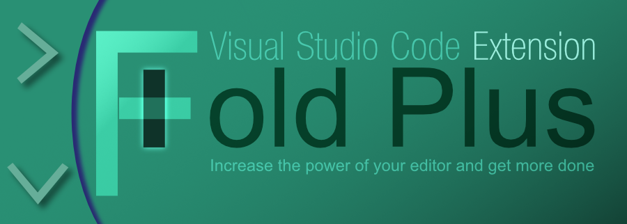

# Fold Plus

Additional Fold Commands for VS Code

## Toggle Indentation/Language Folding
Toggles between `indentation` and `language` folding.  VS Code 1.22 introduced `language` folding which does not support the features of Fold Plus.
This command is provided to easily toggle between each mode.
## Fold All Same Level as Cursor
Determines the level of the line with the active cursor and executes a fold of the entire document at that level.
## Fold All Same Level as Parent
Determines the level of the parent line of the active cursor and executes a fold of the entire document at that level.
## Fold All with Selected Text
Folds the entire document matching the selected text or the word under the cursor.
## Fold All keep Selected Text
Folds the entire document except sections with text matching current selection or current word under the cursor.
## Fold All keep Cursor Line
Folds the entire document except the current line with cursor.
## Fold Parent
Fold parent of current line
## Fold Children
Fold all children of current line
## Unfold All Lines Matching...
Unfold all lines matching a regex
## Unfold All Same Level as Cursor
Unfold all lines same level as cursor line
## Unfold All with Selected Text
Unfold all lines containing the current selected text
