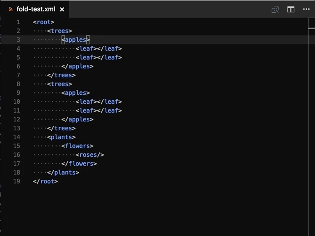

# Fold Plus

Additional Fold Commands for VS Code

## Fold All Same Level as Cursor
Determines the level of the line with the active cursor and executes a fold of the entire document at that level.
## Fold All with Selected Text
Folds the entire document matching the selected text or the word under the cursor.
## Fold All keep Selected Text
Folds the entire document except sections with text matching current selection or current word under the cursor.
